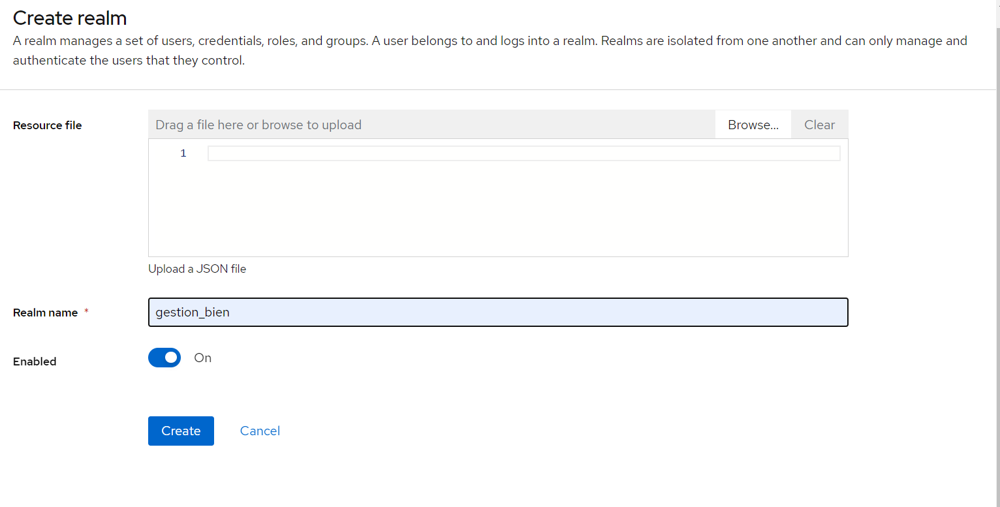
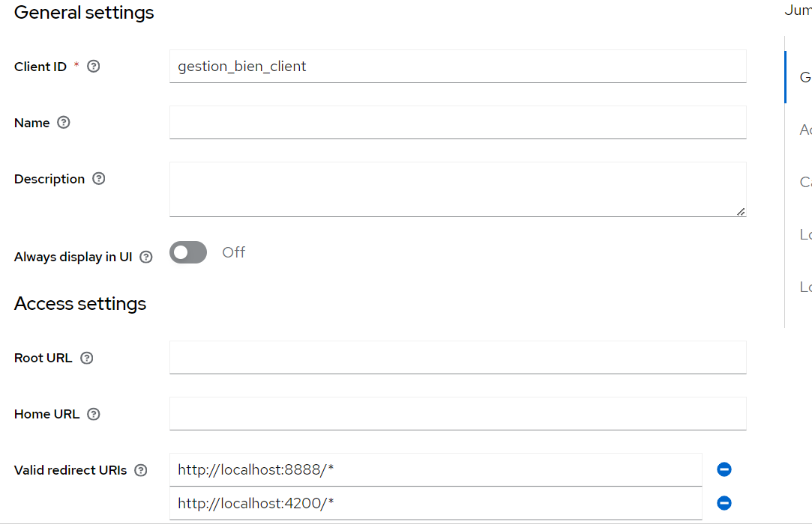
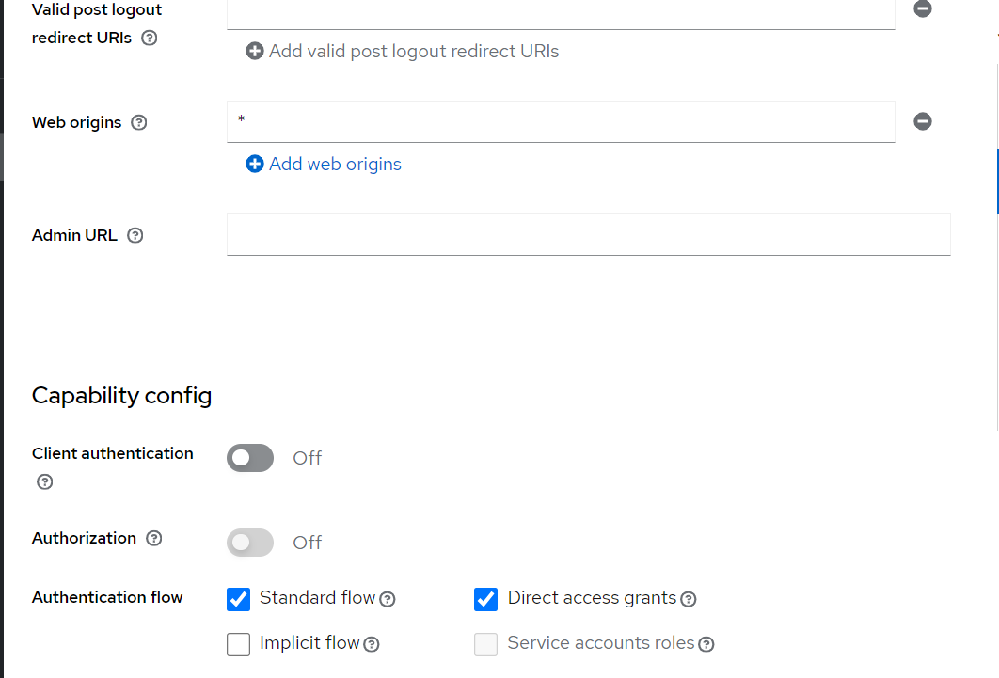
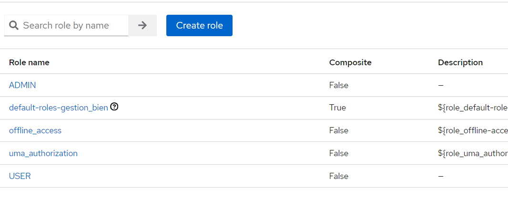
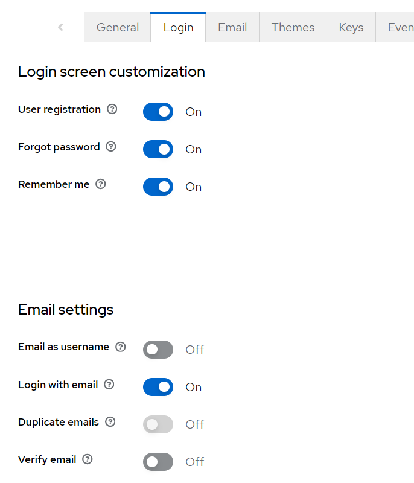

# FSM PRODUCTS MANGEMENT

## Introduction

This project is for managing the university products it provides the following features:

- for unauthentocated users:
  - views products
  - search for products
  - create an account
- for normal users (students, teachers):
  - all the above features
  - create a new order
- for admin users:
  - all the above features
  - manage products (add, update, delete)
  - manage orders (approve, reject, deliver or add new order)
  - manage the inventory (couting the products and the orders)

The project composed of 3 main parts:

- Security interface provided by Keycloak server in docker container
- Frontend application using Angular
- Backend application using Spring Boot

## Requirements

- Docker
- Docker-compose
- Maven (for building the backend)
- Node.js (for building the frontend)
- Angular CLI (for building the frontend)
- Java 17 (for building the backend)
- Keycloak server (for the security)

## Keycloak configuration

the first thing to do after cloning the project is to configure the keycloak server, here is the configuration steps:

- create a new realm called `gestion_bien`
  

- create a neww client called `gestion_bien_client` and set the configuration as follows:
  
  

- create two roles `admin` and `user`:
  

- create two users `admin` and `user` and assign the roles to them

- configure the realm setting as follows (or as you like):
  
  